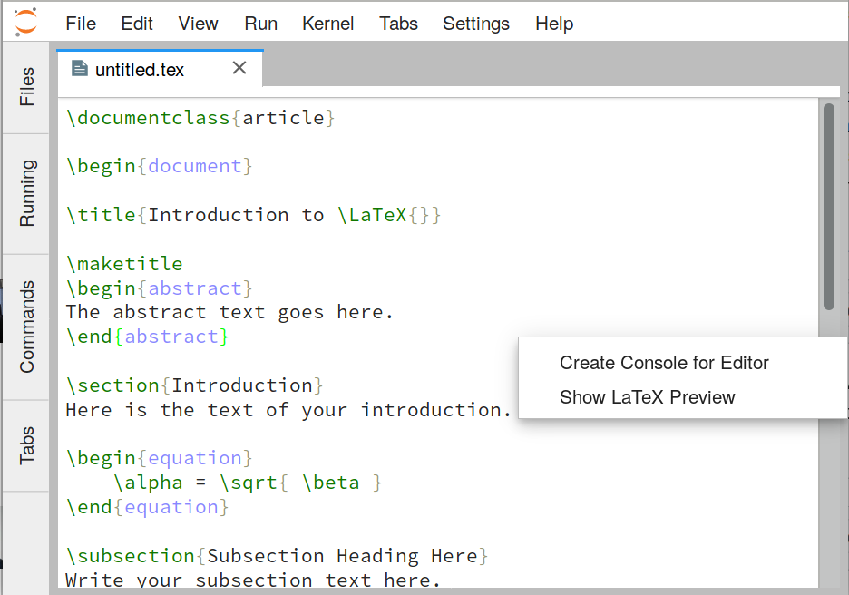

# JupyterLab LaTeX

[](https://mybinder.org/v2/gh/jupyterlab/jupyterlab-latex/master?urlpath=lab%2Ftree%2Fsample.tex)

An extension for JupyterLab which allows for live-editing of LaTeX documents.

## Usage

To use, right-click on an open `.tex` document within JupyterLab, and select `Show LaTeX Preview`:

This will compile the `.tex` file and open the rendered PDF document.
Subsequent saves of the file will automatically update the PDF.
If the PDF fails to compile (possibly due to a syntax error),
an error panel will open detailing the LaTeX error.

## Requirements

* JupyterLab 0.31
* Python >= 3.6
* An application that can compile `.tex` files to PDF (e.g., `pdflatex`, `xelatex`; use `pdflatex.exe` on Windows with MiKTeX). This application must be available as a command in the same environment as the notebook server.
* An application that can process `.bib` files for producing bibliographies. As withe the LaTeX command, this must be available in the same environment as the notebook server.

## Installation

This extension includes both a notebook server extension (which interfaces with the LaTeX compiler)
and a lab extension (which provides the UI for the LaTeX preview).
In order to use it, you must enable both of them.

To install the server extension, run the following in your terminal:
```bash
pip install jupyterlab_latex
```

If you are running Notebook 5.2 or earlier, enable the server extension by running
```bash
jupyter serverextension enable --sys-prefix jupyterlab_latex
```

To install the lab extension, run
```bash
jupyter labextension install @jupyterlab/latex
```

## Installing from source

You can also install from source in order to develop the extension.

From the `jupyterlab-latex` directory, enter the following into your terminal:
```bash
pip install .
```
This installs the server extension.

If you are running Notebook 5.2 or earlier, enable the server extension by running
```bash
jupyter serverextension enable --sys-prefix jupyterlab_latex
```

Then, to install the lab extension, run
```bash
jlpm install
jlpm run build
jupyter labextension install .
```

## Customization

The extension defaults to running `xelatex` on the server.
This command may be customized (e.g., to use `pdflatex` instead) by customizing
your `jupyter_notebook_config.py` file:
```python
c.LatexConfig.latex_command = 'pdflatex'
```

The extension defaults to running `bibtex` for generating a bibliography
if a `.bib` file is found. You can also configure the bibliography command
by setting
```python
c.LatexConfig.bibtex_command = '<custom_bib_command>'
```

LaTeX files have the ability to run arbitrary code by triggering external
shell commands. This is a security risk, and so most LaTeX distributions
restrict the commands that you can run in the shell.

You can customize the behavior by setting the `LatexConfig.shell_escape` value.
It can take three values: `"restricted"` (default) to allow only commands
considered safe to be executed, `"allow"` to allow all commands, and `"disallow"`
to disallow all commands.
For example, to force your LaTeX distribution to run any command, use:
```python
c.LatexConfig.shell_escape = "allow"
```
